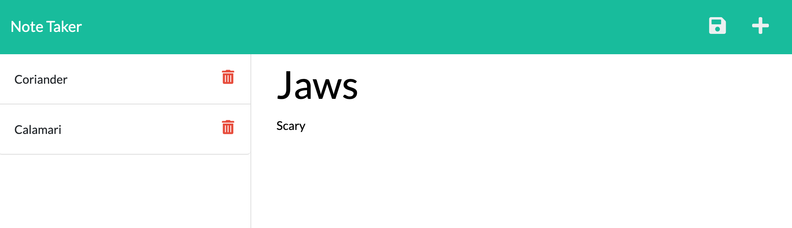

# Note Taker App

  ## Table of Contents
  * [Description](#description)
  * [Technologies Used](#technologies-used)
  * [Usage](#usage)
  * [Contributing](#contributing)
  * [Questions](#questions)

  ## License 
This project is covered under the MIT License.
    
  
  
  Click on the badge to see **MIT License** details.

  ## Description
  - The live [web application](https://murmuring-badlands-28042.herokuapp.com/)

  - Application designed to take user notes as persistent data on a server.  
  - Notes can be accessed, saved, and deleted.  
  - API was built using an Express.js server.

  

  ## Technologies Used
  - Express.js
  - Node.js
  - JavaScript
  - HTML
  - CSS
  - Bootstrap

  ## Usage
  Take notes to enable a more organized personal experience.

  ## Contributing
  Contact me with suggestions for modification and we can talk about how to improve it together.  

  ## Questions
  
  [github.com/jeffMullen](https://github.com/jeffMullen)

  If you have additional questions, feel free to reach me at jeffmullendev@gmail.com